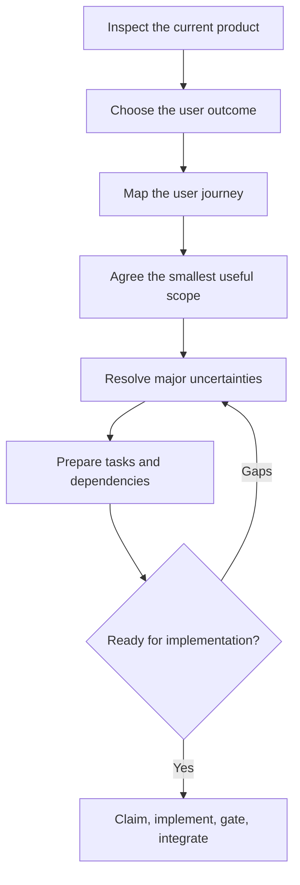

# Milestone planning workflow

Use this process when planning a new milestone or materially changing an agreed milestone's outcome or scope. A small addition takes the short path: [Plan a feature](#plan-a-feature). Planning produces an agreed product scope and an executable backlog; task delivery follows [workflow.md](workflow.md).

The owner decides the user outcome and accepts the scope and tradeoffs. Agents investigate, recommend a scope, prepare task plans and resolve routine engineering choices. Reuse decisions already made in the conversation; ask only for missing owner decisions and continue independent research meanwhile.



The research note carries the planning status as the line under its title: `Planning status: stage <n> closed on <date>; next: stage <n+1>.` Update it whenever a stage closes; a session that resumes planning starts from that line.

## 1. Establish the baseline

Inspect the current delivery state using the [agent workflow's sources of truth](workflow.md#sources-of-truth). Identify the branch and commit being assessed, including changes integrated locally but absent from main. Read the previous milestone's scope, acceptance evidence, limitations and task Completion Notes. Include available user feedback and pilot findings, and the improvement reports under `docs/product/improvements/`: a proposal the owner marked "later" is a candidate, and one marked "no" stays rejected for the reason recorded.

For the first milestone there is no previous one: the baseline is the owner's account of the users and their problem, any existing code, and the [product vision](../product/vision.md), which you write from that account and the owner confirms. Write its core idea as the Purpose of [AGENTS.md](../../AGENTS.md).

Record the findings in `docs/product/milestone<N>-research.md`. Under the status line, open it with the date, the revision inspected and whether any tests were rerun, and mark it as research evidence, not an implementation plan. Then cover what the product delivers today, the evidence boundaries, a table pairing each piece of evidence with the candidate improvement it suggests, and a proposed boundary for the discussion. Distinguish freshly verified behavior, reported evidence and assumptions; distinguish fake-source tests from real-source validation. Carry unfinished work and external blockers forward explicitly.

Then survey existing solutions with a web search: products and open-source projects that serve the same users or the same job. Add an "Existing solutions" section to the note with, for each one, a link, what it does, where it overlaps with this product, and what it solves better or differently. Name the ideas worth adopting and the solutions that make part of this product unnecessary. Cite every claim to a page you opened; mark anything you could not verify as unverified.

Done when the note identifies what users can do today, the important unmet needs, and the evidence or uncertainty behind each candidate improvement, and you have reported to the owner the closest existing solutions, their similarities and every approach of theirs that is better than the current one.

## 2. Choose one user outcome

Recommend an outcome based on user value, delivery effort, dependencies and uncertainty. Have the owner choose the target user and priority. Express the outcome as: "A [user] can [complete a job], demonstrated by [observable result]."

For example: "A Capacity Manager completes two consecutive weekly risk and demand reviews in the product, retaining decisions, evidence, owners and follow-up dates instead of maintaining a separate review spreadsheet." Derive features from the chosen job.

Create `docs/product/milestone<N>.md` with an "Outcome" section: the outcome sentence, the target user and priority the owner chose, and why it matters.

Done when the owner has selected an outcome and `milestone<N>.md` records it with the reason it matters.

## 3. Map the journey and agree scope

Describe the user's starting situation, actions, decisions and final result. Include applicable failure cases such as missing or stale data, insufficient permissions, concurrent changes and restarts. Use a diagram or a small prototype when it resolves a concrete uncertainty.

Complete the draft of `docs/product/milestone<N>.md`: after the outcome, the included capabilities, exclusions, acceptance scenarios, external prerequisites and evidence limits. State the release impact of each unresolved prerequisite. Present the complete proposal and its tradeoffs for the owner's scope decision. Once agreed, state the milestone in one sentence under Product scope in AGENTS.md.

Done when the agreed scope describes a complete useful workflow and observable success, with explicit exclusions. Planning ahead may proceed while the current milestone is active; the draft leaves its delivery scope and queue as they are.

## 4. Resolve major uncertainties

Investigate assumptions that could invalidate the outcome or materially change its cost. Use bounded research or a prototype with a specific question and exit criterion. Record unresolved dependencies, who can resolve them and which tasks they block.

Create Proposed [ADRs](../adr/README.md) for significant architecture choices; for the first milestone these include the stack and the architecture principle. Each decision has an owning task, which resolves and accepts it before implementing dependent behavior. Fill Stack, Architecture principle and the product's own rules in AGENTS.md from the Proposed ADRs. Keep routine implementation choices in the task plan. If findings change the agreed outcome or scope, return to the owner with a revised proposal.

Done when each material uncertainty is resolved or assigned an explicit blocking condition and next action.

## 5. Prepare the delivery backlog

Split the scope into complete, testable features. Each task includes its contracts, owning components, UI and tests where applicable. Use the [task template](../plans/template.md) for plans in `docs/plans/planned/`, with observable acceptance criteria, failure behavior, dependencies and affected components. Every plan has a "Flow" section: a Mermaid flowchart of the journey the task delivers, including its failure paths, or "None: <reason>" for a task with no user-facing journey.

Map every milestone acceptance scenario to the task or tasks that deliver and verify it. Include the necessary authorization, migrations, operations, upgrade, backup/restore and final release acceptance work. The last task of the milestone is its [acceptance task](workflow.md#the-acceptance-task): it depends on every other task, exercises the assembled user journey on the actual release artifacts, and delivers `docs/product/milestone<N>-test.md` with the milestone review and the owner's acceptance. Keep real-source pilot evidence separate from fixture acceptance. The first task of the first milestone bootstraps the development platform: it gives `make lint`, `make test` and the gates their product stages.

When preparing the agreed delivery queue, map stable task IDs, plans, tracker issues, dependencies and ADRs in [backlog.json](../plans/backlog.json):

```json
{
  "id": "CAP-001",
  "title": "Bootstrap the development platform",
  "slug": "bootstrap-development-platform",
  "issue": null,
  "depends_on": [],
  "adrs": ["docs/adr/001-title.md"],
  "external_blocker": null
}
```

The plan is `docs/plans/planned/<id>-<slug>.md`. Register a new task with `"issue": null`: stage 6 creates the issues and records their numbers. `external_blocker` says what blocks the task from outside and who can resolve it. Reuse unfinished tasks with their existing IDs, issues and blockers. Preserve completed plans and their evidence.

Add a "Task dependencies" section to `docs/product/milestone<N>.md` with a Mermaid graph of all the milestone's tasks: one node per task, one edge per `depends_on` entry of the manifest, and nothing else.

Then run `node scripts/agent-summary.mjs`. It writes `docs/product/milestone<N>-summary.html`, the implementation summary for the owner: the scope, the dependency graph drawn from the manifest, and every unfinished task with its goal, acceptance criteria and flow, followed by their ADRs. Open it for the owner. The page is a view of the plans: change a plan and regenerate, never edit the page.

Done when every included capability has an owner task and a proof of completion, every plan has its Flow, the owner has the implementation summary, and the dependency graph in `milestone<N>.md` matches `depends_on` in the manifest, with no cycles or hidden prerequisites.

## 6. Check readiness and hand off

Before switching delivery to the next milestone:

- Record the agreed scope and exact starting revision; account for unfinished work from the previous milestone.
- Update the manifest's `milestone` and `integration_branch` together with the delivery instructions: the product scope and the repository map of [AGENTS.md](../../AGENTS.md). Coordinate this transition after the active queue is finished or explicitly handed off; preserve its claims and branches.
- Commit the planning documents on main and create the integration branch `milestone<N>` from it.
- Where the manifest names a `repository`: run `node scripts/agent-issues.mjs sync`, which creates the GitHub milestone, the status labels and one issue per task and writes the issue numbers into the manifest and the plans; regenerate the implementation summary; commit both on main and move the still unclaimed integration branch to that commit with `git branch -f milestone<N> main`. Then push main and run `node scripts/agent-local.mjs publish`, which pushes the integration branch and gives every issue its status.
- Check every milestone acceptance scenario against the task mapping, including failure and release scenarios.
- Ensure every unresolved blocker is visible and independent tasks remain selectable. Defer a release prerequisite only through an explicit scope decision, preserving the uncompleted work.
- Run `make agent-check`, `bash tests/integration/check-docs.sh` and `git diff --check` after preparing the queue. These validate structure, not product acceptance or the value of the chosen scope.
- Run `node scripts/agent-local.mjs next` in the delivery checkout and confirm that readiness matches the intended dependencies. With a `repository`, `node scripts/agent-issues.mjs sync --check` passes.

Planning is ready for implementation when these checks pass and the handoff identifies the first ready task, and remaining blockers. Continue through [the delivery workflow](workflow.md); keep gate and integration rules there as the single source of truth.

## Plan a feature

The short path for a small addition: at most three tasks and no new architecture decision. A request that is larger, needs an ADR, or falls under an agreed exclusion is a milestone's work: say which of the three applies, stop, and plan it through the six stages.

1. **Clarify.** State the feature as "A [user] can [do something], demonstrated by [observable result]" and have the owner confirm the sentence.
2. **Check the fit.** Read the current scope with its exclusions, the ADRs, the code the feature touches, and the improvement report the feature comes from, where `docs/product/improvements/` has one. Continue only when it passes the three limits above.
3. **Plan.** Write one to three plans from the [task template](../plans/template.md), numbered after the highest task ID, each with observable acceptance criteria, failure behaviour and a Flow. Present them for the owner's approval.
4. **Register** the approved tasks in [backlog.json](../plans/backlog.json) with `"issue": null`, and record the feature under "Added features" in `docs/product/milestone<N>.md`: the date, the sentence and the task IDs. Where the tasks go depends on the integration branch:
   - **Not yet merged into main** (a milestone or a feature is in progress, or awaits its pull request): the feature joins it. Add the tasks to the acceptance task's `depends_on` and to its plan's Dependencies line, unless that task is already claimed. `claim` the first feature task, switch to its branch and commit the plans, the manifest and the scope there; the task stays claimed for delivery. A feature that joins a milestone the owner has already accepted repeats the owner's test: say so before step 3.
   - **Merged into main** (nothing is in progress): the feature stands alone. Set `integration_branch` to `feature/<slug>`, commit the plans, the manifest and the scope on main, and create that branch from main. With a `repository`: run `node scripts/agent-issues.mjs sync`, commit the issue numbers on main, move the still unclaimed branch with `git branch -f feature/<slug> main`, push main and run `node scripts/agent-local.mjs publish`. Delivery follows [A standalone feature](workflow.md#a-standalone-feature).
5. **Hand off.** Run `node scripts/agent-summary.mjs`, `make agent-check` and `bash tests/integration/check-docs.sh`, and name the first task with the output of `node scripts/agent-local.mjs next`.

Done when the owner has approved the plans, the checks pass and `next` shows the feature's first task as claimed or ready.
